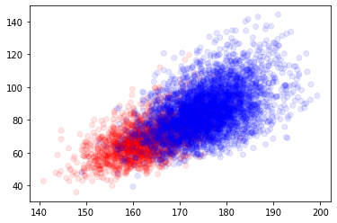
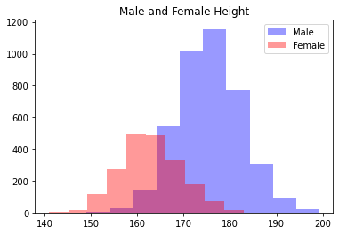

# ANSUR II DATASET

#### Weight and Height plot

### Height Plot for Male and Female

- Heights of Female Average: 162.847 👩🏽
- Heights of Male Average: 175.621 👨🏽

## KNN Algorithm

| K     | Score   |
| ---   | ---     |
| 3     | 82.53 % |
| 5     | 83.52 % |
| 7     | 83.27 % |
| 9     | 83.77 % |